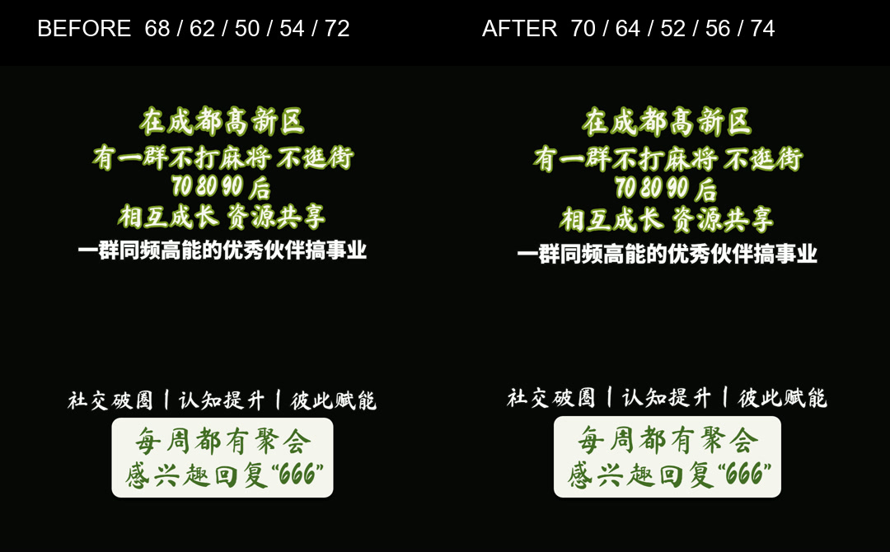

# HyperFrames reference typography evidence

## v01 green handwritten size adjustment

This frame-0 comparison uses the same copy and browser-rendered composition on
both sides. Only the five locked font sizes change; color, typeface, stroke,
positioning, motion, template order, and every other template remain unchanged.

| Layer | Before | After |
| --- | ---: | ---: |
| top1 | 68px | 70px |
| top2 | 62px | 64px |
| top3 | 50px | 52px |
| bottom1 | 54px | 56px |
| bottom2 | 72px | 74px |

The comparison intentionally contains only v01's fixed black typography zones;
the random material band is omitted and no preview material is committed.

HyperFrames check result for the after state: 0 lint errors, 0 runtime errors,
0 layout issues across 9 samples, 0 motion errors, and 25/25 WCAG AA text
contrast checks passed.

## v05 featured style

This comparison documents the v05 typography change at frame 0 on a 1080 x
1920 canvas. Both sides use the exact same frozen browser frame, background,
copy, canvas size, and media state; only the v05 CSS differs.

- **Before / old v05:** Ma Shan Zheng handwritten title, red third line, plain
  white CTA.
- **After / new v05:** template-locked Noto Sans SC heavy title, blue-black
  stroke and hard shadow, yellow CTA button.

The comparison JPEG scales each 1080 x 1920 source frame to 540 x 960 only for
side-by-side review. The unscaled source frames were checked before composing
the comparison.

## Frozen copy

- `top1`: 在长沙有一群认真搞
- `top2`: 事业的人不内耗
- `top3`: 不躺平只专注成长
- `bottom1`: 每周不同主题交流，想参加
- `bottom2`: 留言同行，我拉你一起加入

## After-layout bounds

The new layout remains inside the 1080 x 1920 canvas:

| Layer | Left | Top | Right | Bottom |
| --- | ---: | ---: | ---: | ---: |
| top1 | 42.0 | 112.0 | 1038.0 | 216.0 |
| top2 | 42.0 | 228.0 | 1038.0 | 333.0 |
| top3 | 42.0 | 357.0 | 1038.0 | 427.8 |
| bottom1 | 42.0 | 1576.0 | 1038.0 | 1647.8 |
| bottom2 | 100.7 | 1675.8 | 979.3 | 1792.0 |

No MP4 render is committed; this still is review evidence only.
