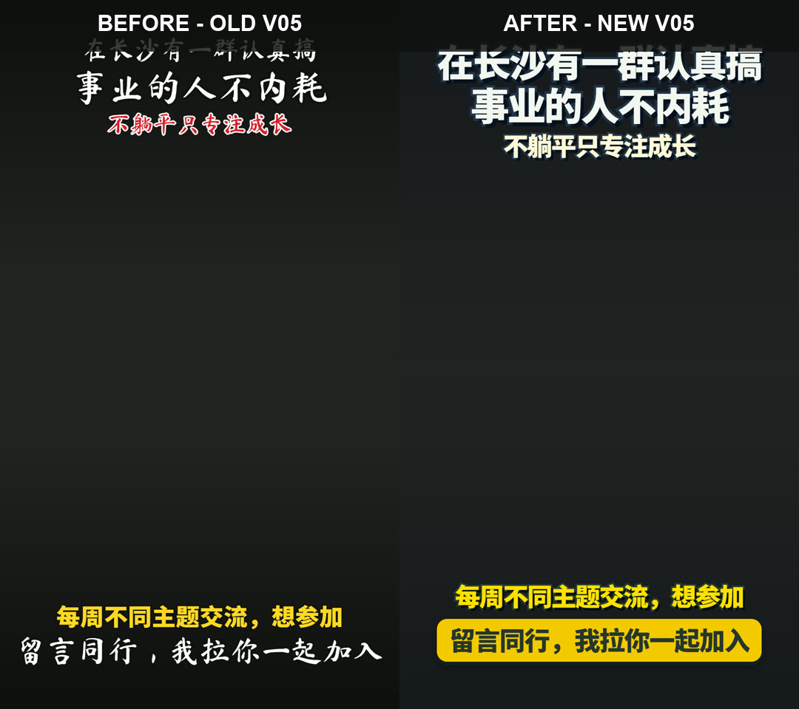

# HyperFrames v05 before/after evidence

This comparison documents the v05 typography change at frame 0 on a 1080 x
1920 canvas. Both sides use the exact same frozen browser frame, background,
copy, canvas size, and media state; only the v05 CSS differs.

- **Before / old v05:** Ma Shan Zheng handwritten title, red third line, plain
  white CTA.
- **After / new v05:** template-locked Noto Sans SC heavy title, blue-black
  stroke and hard shadow, yellow CTA button.

The comparison JPEG scales each 1080 x 1920 source frame to 540 x 960 only for
side-by-side review. The unscaled source frames were checked before composing
the comparison.

## Frozen copy

- `top1`: 在长沙有一群认真搞
- `top2`: 事业的人不内耗
- `top3`: 不躺平只专注成长
- `bottom1`: 每周不同主题交流，想参加
- `bottom2`: 留言同行，我拉你一起加入

## After-layout bounds

The new layout remains inside the 1080 x 1920 canvas:

| Layer | Left | Top | Right | Bottom |
| --- | ---: | ---: | ---: | ---: |
| top1 | 42.0 | 112.0 | 1038.0 | 216.0 |
| top2 | 42.0 | 228.0 | 1038.0 | 333.0 |
| top3 | 42.0 | 357.0 | 1038.0 | 427.8 |
| bottom1 | 42.0 | 1576.0 | 1038.0 | 1647.8 |
| bottom2 | 100.7 | 1675.8 | 979.3 | 1792.0 |

No MP4 render is committed; this still is review evidence only.
